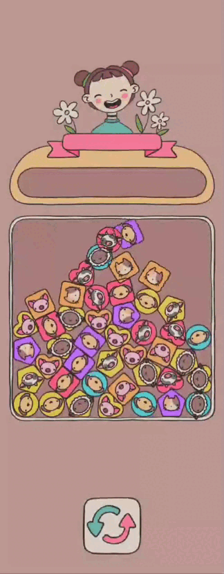
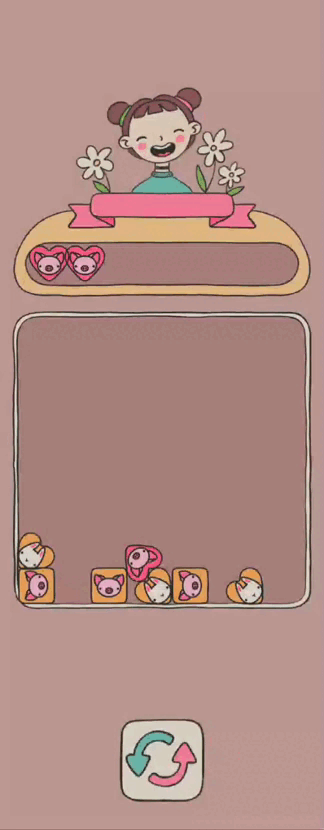

# Fall & Match  
A prototype of a casual 2D game in Unity with physics, match-three mechanics, and mobile adaptation.

---

## ✨ Implementation Features

- ✔️ Full-featured level generation scene with physics-based falling of figures  
- ✔️ Smooth transition between scenes via Initial scene and Game scene using Zenject infrastructure  
- ✔️ Clean architecture with a finite state machine (FSM) for managing game states  
- ✔️ Game restart infrastructure via the `IRestartable` interface and centralized registration  
- ✔️ Interface adaptation for different screen sizes (including mobile)  
- ✔️ FPS limit removed: runs stably at 60+ FPS on Android  
- ✔️ Regeneration button with complete field recreation  

---

## 🎮 Gameplay

### 🛀 Falling Figures on Start  
Figures are created in generation order and fall under gravity, bouncing and filling the field like grains of sand.

### 📏 Match Mechanics  
Clicking a figure sends it to the action bar at the top.  
If there are three identical figures (shape + color + animal), they disappear.  
The bar has 7 slots — if it fills up, the player loses.

### 🔃 Field Regeneration  
Clears current objects from the field.  
Spawns the same number of new ones, following the same rules (in sets of three).

### 🎉 Win and Lose Screens  
**Victory**: the field is completely cleared — a congratulatory message is shown.  
**Defeat**: the bar is full — a defeat screen is shown.

### 🚀 Startup and State Machine  
The game starts from the Initial scene; then `BootstrapState` loads the game scene.  
Then it transitions to `GameLoopState`, where logic, UI, and `IRestartable` object registration begin.  
Supports level restart without reloading the scene.

---

# Fall & Match  
Прототип казуальной 2D-игры на Unity с физикой, сбором трёх одинаковых элементов и адаптацией под мобильные устройства.

---

## ✨ Особенности реализации

- ✔️ Полноценная сцена генерации уровня с физическим падением фигурок  
- ✔️ Плавное переключение между сценами через Initial-сцену и Game-сцену с Zenject-инфраструктурой  
- ✔️ Чистая архитектура с конечным автоматом (FSM) для управления состояниями игры  
- ✔️ Инфраструктура перезапуска игры через интерфейс `IRestartable` и централизованную регистрацию  
- ✔️ Адаптация интерфейса под разные экраны (включая мобильные)  
- ✔️ FPS-ограничение снято: работает стабильно 60+ кадров на Android  
- ✔️ Кнопка пересбора с полной пересозданием поля  

---

## 🎮 Геймплей

### 🛀 Падение фигур при запуске  
Фигуры создаются в порядке генерации и падают под действием гравитации, отскакивая и заполняя поле как песчинки.

### 📏 Механика матчей  
Клик по фигурке отправляет её в экшен-бар сверху.  
Если три одинаковые (форма + цвет + животное) — они исчезают.  
Бар на 7 ячеек — если он заполняется, игрок проигрывает.

### 🔃 Пересбор поля  
Стирает текущие объекты с поля.  
Насыпает столько же новых, по тем же правилам (по три).

### 🎉 Экран победы и поражения  
**Победа**: всё поле очищено — поздравление.  
**Проигрыш**: бар переполнен — экран поражения.

### 🚀 Старт и стейт-машина  
Старт с Initial-сцены, далее `BootstrapState` загружает игровую сцену.  
Затем происходит переход в `GameLoopState`, где запускается логика, отображение и регистрация `IRestartable`-объектов.  
Поддержка перезапуска уровня без перезагрузки сцены.
